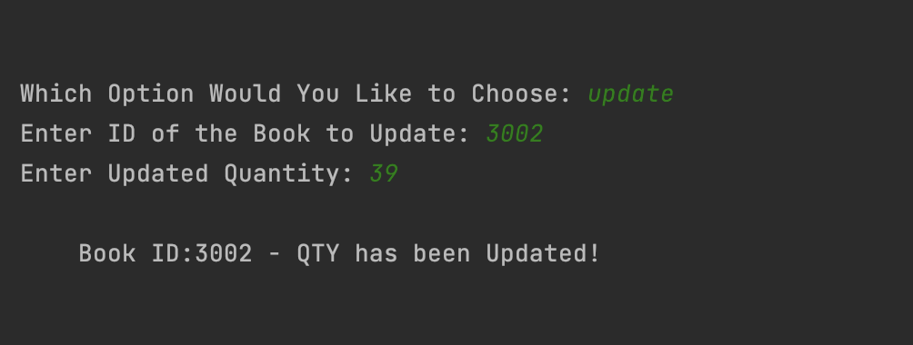
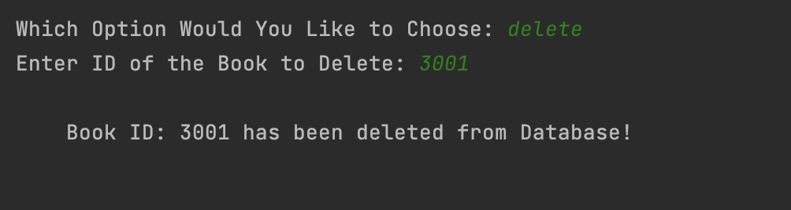

# Ebookstore Program

This is a Python program that simulates an ebookstore inventory management system. It uses a SQLite database to store book records, and provides an interface for users to add, update, delete, and search for books.
## Table of Contents

* Features
* Requirements
* Installation
* Usage
## Features

- Add a new book to the database
- Update the quantity of an existing book
- Delete a book from the database
- Search for books by ID, title, or author

## Requirements

* Python3
* SqLite3
## Installation

1. Clone this repository to your local machine
2. Install the required dependencies (Python3 and SQLite)
3. Open the command prompt or terminal and navigate to the project directory
4. Run the program by typing 'python3 ebookstore.py'
## Usage/Examples

Once the program is running, you will be presented with the options menu.
Choose an option to execute:

1. To add a new book, choose "add" from the main menu and enter the book details when prompted:

2. To update the quantity of a book, choose "update" from the main menu and enter the book ID and updated quantity when prompted:

3. To delete a book from the database, choose "delete" from the main menu and enter the book ID when prompted:

4. To search for a book, choose "search" from the main menu and enter the search term (ID, title, or author) when prompted:

5. To exit program, choose "exit" from the main menu:

